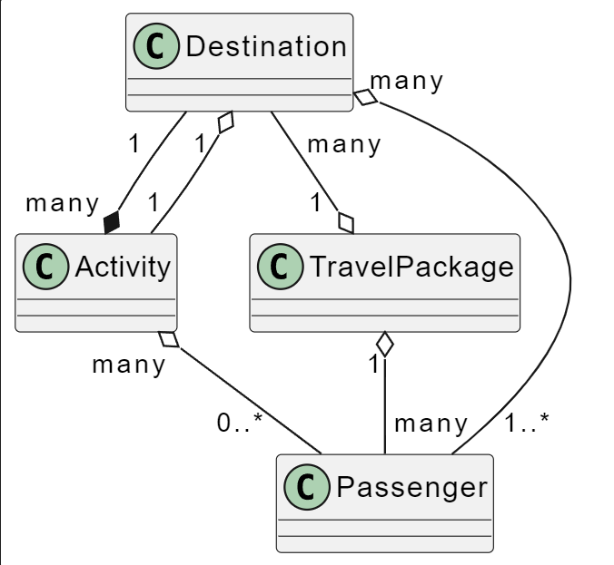
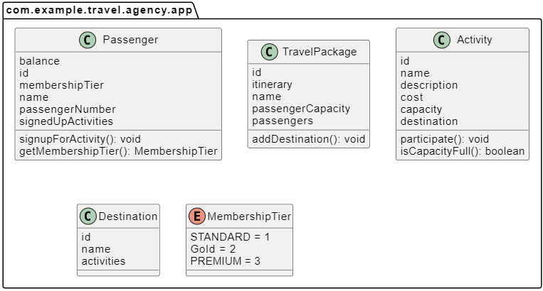

# Software Design Task (Java)

### The task

Design, implement and test a software system\
that allows travel agencies to maintain their\
travel packages' itinerary and passengers.

### Implementation

This is a gradle (wrapper) based project.\
For usage on how to build and run tests,\
read the respective sections given below.

### Building

Follow the instructions based on your OS

#### Windows
```sh
# using the file properties window accesible in
# the context menu, grant read and execute permisson
# to the file "gradlew" and then do the following:

# Omit the ".\" if using cmd
.\gradlew.bat build
```

#### *nix based OS
```sh
./gradlew build
```

### Testing

The tests are written using JUnit Jupiter (v5).\
To run them do the following:

```sh
[.\]gradlew[.bat] test
```

OR

```sh
./gradlew test
```
---
### Higher level Diagram



### Lower Level Diagram


(_generated using PlantUML and its plugin in VS Code_)

Copyright &copy; 2023 Bharat Dev Burman

